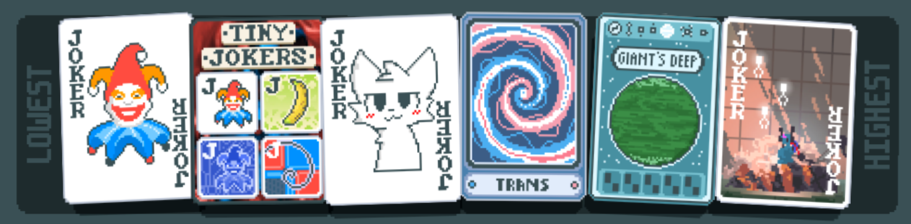
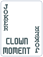
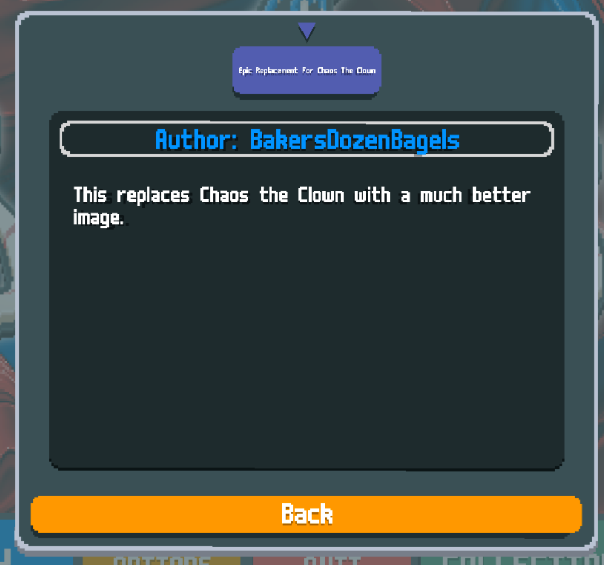
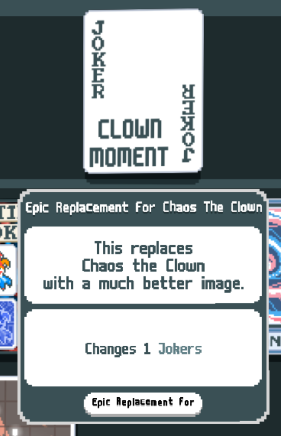
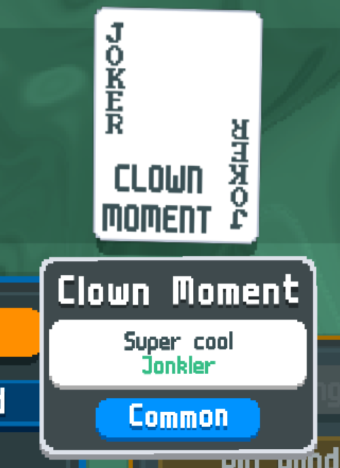
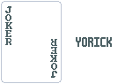
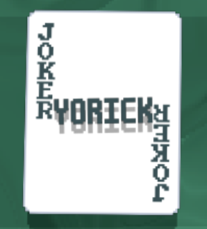
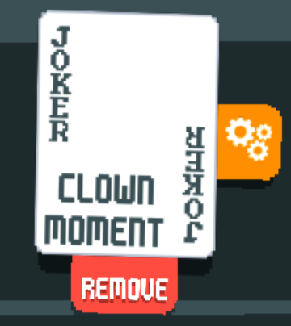
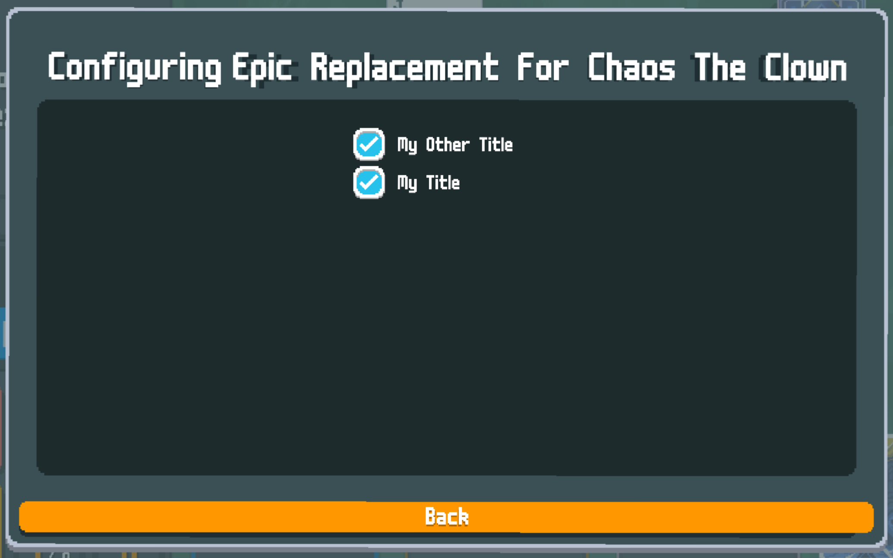

# Making a Texture Pack With Malverk

## What is Malverk?

[Malverk](https://github.com/Eremel/Malverk) is a texture pack manager for [Balatro](https://www.playbalatro.com/). It makes it easy for artists to distribute their work, and it makes it easy for end users to use it.

Malverk also has powerful tools for mixing and matching texture packs. For example, both [Balatro Wilds](https://github.com/NataKilar/Balatro-Wilds) and [SpecTrans](https://github.com/Eremel/SpecTrans) modify Black Hole. I can still use both texture packs and even specify which one wins for Black Hole.



## Making a Texture Pack

For this tutorial, I will assume you already have artwork made. For now I'll assume each image is separate, but you can also put them in a spritesheet to match the vanilla game. I will demonstrate replacing Chaos the Clown.



### Making a Mod

First, create your `.json` file. This can be called anything, but I recommend `manifest.json`. This file tells Steamodded how to load your mod.

```json
{
	"id": "myEpicTexturePack",
	"name": "Epic Replacement For Chaos The Clown",
	"author": ["BakersDozenBagels"],
	"description": "This replaces Chaos the Clown with a much better image.",
	"prefix": "myEpicTexturePack",
	"main_file": "main.lua",
	"badge_colour": "ffffff",
	"badge_text_colour": "000000",
	"version": "1.0.0",
	"dependencies": [
		"Steamodded (>=1.*)",
		"malverk"
	]
}
```
Feel free to change any of the fields here. Make sure you choose an ID and a prefix no other mod will use. You will also need the prefix later.

Next, create `main.lua` (or whatever you called it in your `.json`). Leave it as an empty file for now.

The mod should now load in game, although it won't do anything.



Now, create your `assets` directory (we'll generate the 2x texture in a moment):
```
.
├── assets
│   ├── 1x
│   │   └── ExampleTexture.png
│   └── 2x
├── main.lua
└── manifest.json
```

I like to use [ImageMagick](https://imagemagick.org/) to generate the 2x versions of my textures. I put this script in my `assets` directory:

Windows (`upscale.bat`):
```bat
for /F %%x in ('dir /B/D 1x') do magick 1x\%%x -filter point -resize 200%% 2x\%%x
```
MacOS or Linux (`upscale.sh`):
```sh
#!/bin/sh
for file in 1x/*.png; do
    filename=$(basename "$file")
    output_file="2x/${filename}"
    magick "$file" -filter point -resize 200% "$output_file"
done
```

With ImageMagick installed, running this script will upscale your images. Your tree should now look like this:
```
.
├── assets
│   ├── 1x
│   │   └── ExampleTexture.png
│   ├── 2x
│   │   └── ExampleTexture.png
│   ├── upscale.bat
│   └── upscale.sh
├── main.lua
└── mod.json
```

### The Lua

Let's start with the `AltTexture`. You will add one of these for each image in your `1x` directory.

In `main.lua`:
```lua
AltTexture {
    key = "ExampleTexture",          -- You make this up. Make sure each one is unique. I recommend just using the filename without the extension.
    set = "Joker",                   -- Joker, Tarot, Voucher, Tag, etc
    path = "ExampleTexture.png",
    keys = { "j_chaos" },            -- List all the items you're changing here. You can search the translation files in the game's code to find the IDs easily.
    loc_txt = { name = "My Title" }, -- Name of the replacement; I'll talk about this in a bit.
    localization = {                 -- Use this section to change text with your texture pack.
        j_chaos = {
            name = "Clown Moment",
            text = { "Super cool", "{C:green}Jonkler" }
        }
    },
    original_sheet = false, -- Set this to true if your sprite sheet matches the original (i.e. if you could drop it in the game to replace the original without issue)
    px = nil,               -- Set these if you have a higher resolution texture pack.
    py = nil
}
```

Now, we'll make the `TexturePack`. You only need one for your whole mod.
```lua
TexturePack {
    key = "myEpicTexturePack", -- Not very important, use whatever here
    textures = { "myEpicTexturePack_ExampleTexture" }, -- This is a list of all of your `AltTexture`s. Include the prefix from `manifest.json`.
    loc_txt = {                                        -- This information shows up in the Malverk UI.
        name = "Epic Replacement For Chaos The Clown",
        text = { "This replaces", "Chaos the Clown", "with a much better image." }
    }
}
```

That's all you need to do! Let's look at the mod in game.





### Adding Another Retexture

Now, I'll retexture Yorick.



In `main.lua`:
```lua
AltTexture {
    key = "YorickTexture",
    set = "Joker",
    path = "YorickTexture.png",
    keys = { "j_yorick" },
    loc_txt = { name = "My Other Title" },
    localization = {
        j_yorick = {
            name = "Sad Yorick",
        }
    },
    soul_keys = { "j_yorick" }
}
```

And modifying our `TexturePack`:
```lua
TexturePack {
    ...,
    textures = {
        "myEpicTexturePack_ExampleTexture",
        "myEpicTexturePack_YorickTexture",
    },
    ...
}
```

Now Yorick will be retextured, too.



## In Game Settings

Now that you have multiple `AltTexture`s, the Malverk UI has an extra feature. Your texture pack will have a settings button.



In this menu, the end user can individually toggle each `AltTexture`. Make sure you give them nice names so you can tell what they are later (this is what the `loc_txt = { name = "My Title" }` is).



## Beyond

Malverk has a few more advanced features if you really need them, but this should be enough to get you started. Check [its readme](https://github.com/Eremel/Malverk) if you need more information.